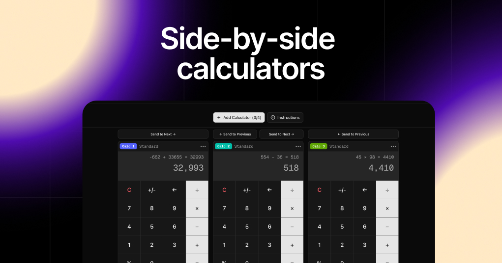

  <h3 align="center">Multiple Calculators, side-by-side</h3>

  

A simple, calculator app that allows you to perform multiple calculations in parallel, with calculators next to each other.
     
    <a href="https://multiple-calculators.pages.dev/"><strong>Try it now »</strong></a>
     
     

  
 

  

## Overview

A simple, calculator app that allows you to perform multiple calculations in parallel, with calculators next to each other. The app is designed to be simple and easy to use, with a focus on providing a clean and intuitive user interface.

## Built With

- [![Next][Next.js]][Next-url]
- [![React][React.js]][React-url]
- [![Tailwind][Tailwind]][Tailwind-url]
- [![shadcn/ui][shadcn/ui]][shadcn/ui-url]

## License

Distributed under the MIT License. See `LICENSE.txt` for more information.

<!-- MARKDOWN LINKS & IMAGES -->
<!-- https://www.markdownguide.org/basic-syntax/#reference-style-links -->

[Next.js]: https://img.shields.io/badge/next.js-000000?style=for-the-badge&logo=nextdotjs&logoColor=white
[Tailwind]: https://img.shields.io/badge/tailwind-06B6D4?style=for-the-badge&logo=tailwindcss&logoColor=white
[Tailwind-url]: https://tailwindcss.com/
[shadcn/ui]: https://img.shields.io/badge/shadcnui-000000?style=for-the-badge&logo=shadcnui&logoColor=white
[shadcn/ui-url]: https://ui.shadcn.com
[Next-url]: https://nextjs.org/
[React.js]: https://img.shields.io/badge/React-20232A?style=for-the-badge&logo=react&logoColor=61DAFB
[React-url]: https://reactjs.org/
